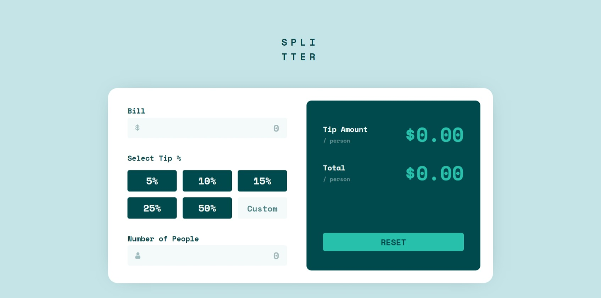
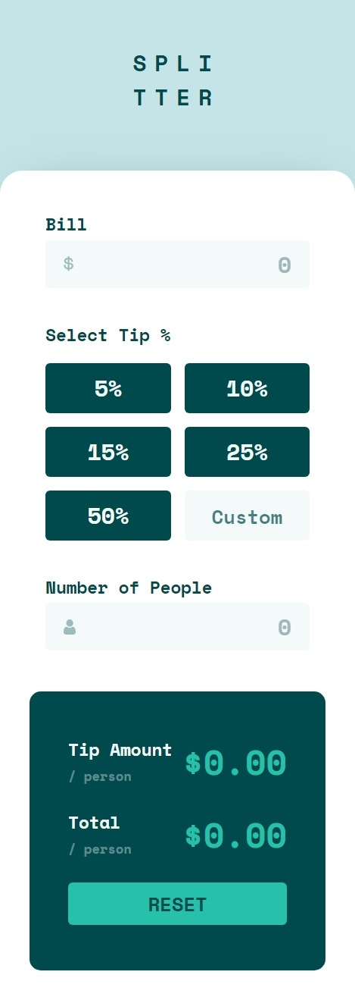

# Frontend Mentor - Testimonials grid section solution

This is a solution to the [Testimonials grid section challenge on Frontend Mentor](https://www.frontendmentor.io/challenges/testimonials-grid-section-Nnw6J7Un7). Frontend Mentor challenges help you improve your coding skills by building realistic projects. 

## Table of contents

- [Overview](#overview)
  - [The challenge](#the-challenge)
  - [Screenshots](#screenshots)
  - [Links](#links)
- [My process](#my-process)
  - [Built with](#built-with)
- [Author](#author)

## Overview

### The challenge

Users should be able to:
- View the optimal layout for the site depending on their device's screen size

### Screenshots
- **DESKTOP VIEW**
---

- **MOBILE VIEW**
---

### Links

- Solution URL: [My solutions page](https://www.frontendmentor.io/profile/Ahmed-NabilWahdan/solutions)
- Live Site URL: [Live site by GitHub](https://ahmed-nabilwahdan.github.io/Testimonials-Grid-Section/)

## My process

### Built with

- Semantic HTML5 markup
- CSS custom properties
- Flexbox
- CSS Grid
- Desktop-first workflow

## Author
- Frontend Mentor - [@Ahmed-NabilWahdan](https://www.frontendmentor.io/profile/Ahmed-NabilWahdan)